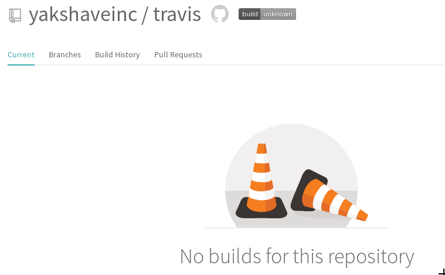
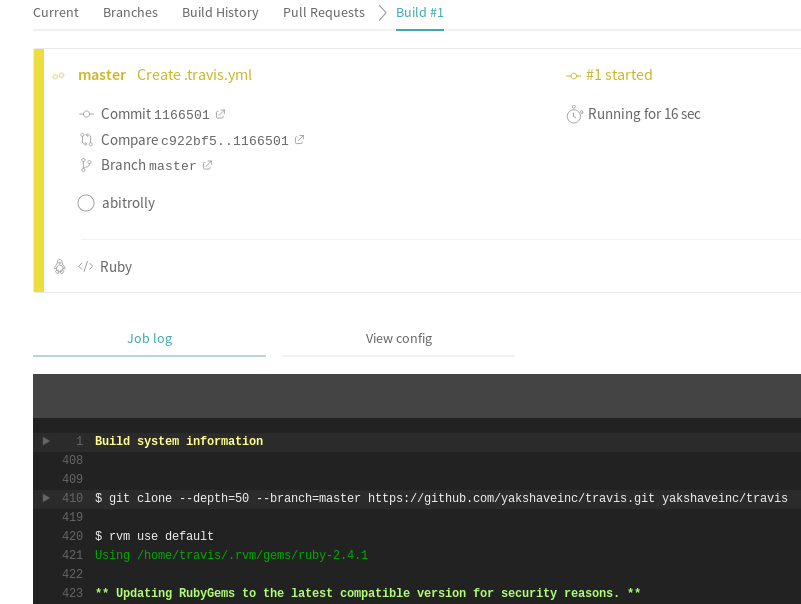
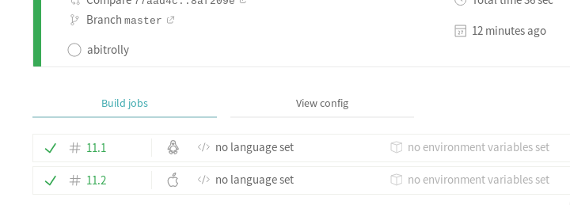
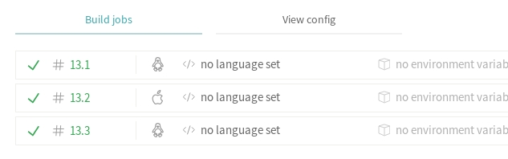
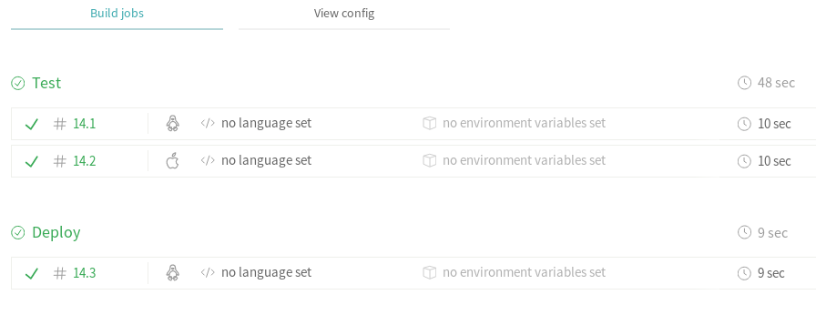

SOP and reference for [Travis CI](https://travis-ci.com/) setup.

* [x] Enable Travis from https://github.com/marketplace/travis-ci
* [x] Go https://travis-ci.com/yakshaveinc/travis and hit the badge to steal it
* [x] Insert the badge [](https://travis-ci.com/yakshaveinc/travis)




### Create .travis.yml

* [x] [Empty .travis.yml](https://travis-ci.com/yakshaveinc/travis/builds/101078477)
starts **default job** in Ruby environment.



* [x] `script: skip` stops Ruby environment from failing ([build #4](https://travis-ci.com/yakshaveinc/travis/builds/101115865))
```yaml
script: skip
```

* [x] `language: minimal` switches from Ruby to [alternative environment](https://docs.travis-ci.com/user/languages/minimal-and-generic/)
without default scripts ([build #9](https://travis-ci.com/yakshaveinc/travis/builds/101122898))
```yaml
language: minimal
```

Using invalid language like [`language: none`](https://travis-ci.com/yakshaveinc/travis/jobs/178150572) or
[misspelled](https://travis-ci.com/yakshaveinc/travis/jobs/178155333) will default to Ruby without any errors.


### Set build matrix for parallel runs

* [x] `os` key splits execution of **default job** into different os images
([build #11](https://travis-ci.com/yakshaveinc/travis/builds/101177747))
```yaml
language: minimal
os:
  - linux
  - osx
```
https://docs.travis-ci.com/user/multi-os/



* [x] `jobs` key is used to add or remove jobs
```yaml
language: minimal
os:
  - linux
  - osx
jobs:
  include:
    - script: echo $TRAVIS_OS_NAME
```
The script runs three steps. Two for **default job** on Linux and MacOS that do nothing. One from jobs section that prints
variable. The last job from jobs section executes only for Linux, because it is not affected by `os` matrix expansion.
([build #13](https://travis-ci.com/yakshaveinc/travis/builds/101178517))



All jobs here are run in parallel.

* [x] `stage` to run jobs in sequence

Modify `.travis.yml` to `stage` name `deploy` to the `jobs` section.

```yaml
language: minimal
os:
  - linux
  - osx
jobs:
  include:
    - stage: deploy
      script: echo $TRAVIS_OS_NAME
```

**default job** is now run in default stage called `Test` - the title is ommitted if there is only one stage - and the new job is
located at `Deploy` section.
([build #14](https://travis-ci.com/yakshaveinc/travis/builds/101179101))


