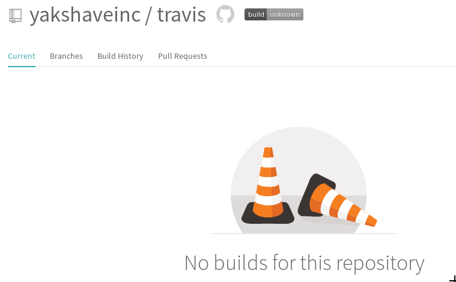

SOP and reference for [Travis CI](https://travis-ci.com/) setup.

* [x] Enable Travis from https://github.com/marketplace/travis-ci
* [x] Go https://travis-ci.com/yakshaveinc/travis and hit the badge to steal it
* [x] Insert the badge 

### Create .travis.yml
